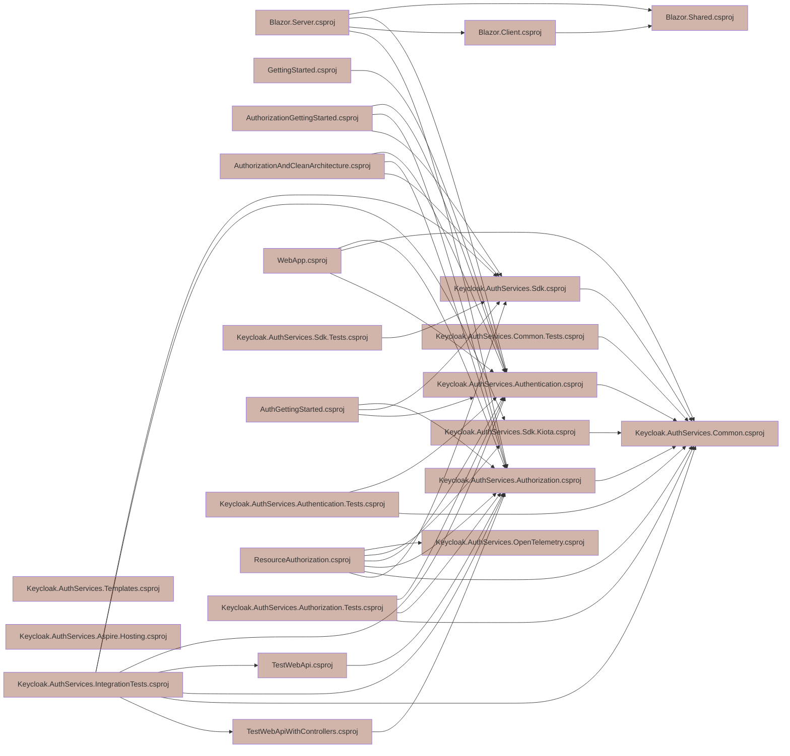

# Dependify

[](https://github.com/NikiforovAll/dependify/actions/workflows/build.yml)
[](https://nuget.org/packages/Dependify.Cli)
[](https://github.com/nikiforovall/dependify)
[](https://conventionalcommits.org)
[](https://github.com/nikiforovall/dependify/blob/main/LICENSE.md)


## Install

```bash
dotnet tool install -g Dependify.Cli
```

```bash
dependify graph --help
```
    
```text
USAGE:
    dependify graph [OPTIONS] <COMMAND>

EXAMPLES:
    dependify graph scan ./path/to/folder --framework net8
    dependify graph show ./path/to/project --framework net8

OPTIONS:
    -h, --help    Prints help information

COMMANDS:
    scan <path>    Scans for projects and solutions and retrives their dependencies
    show <path>    Shows the dependencies of a project or solution located in the specified path
```

## Example

```bash
dependify graph scan \
    $dev/keycloak-authorization-services-dotnet/ \
    --framework net8
```


```bash
dependify graph scan \
    $dev/keycloak-authorization-services-dotnet/ \
    --exclude-sln \
    --framework net8 \
    --format mermaid \
    --output ./graph.md
```



## Build and Development

`dotnet cake --target build`

`dotnet cake --target test`

`dotnet cake --target pack`
