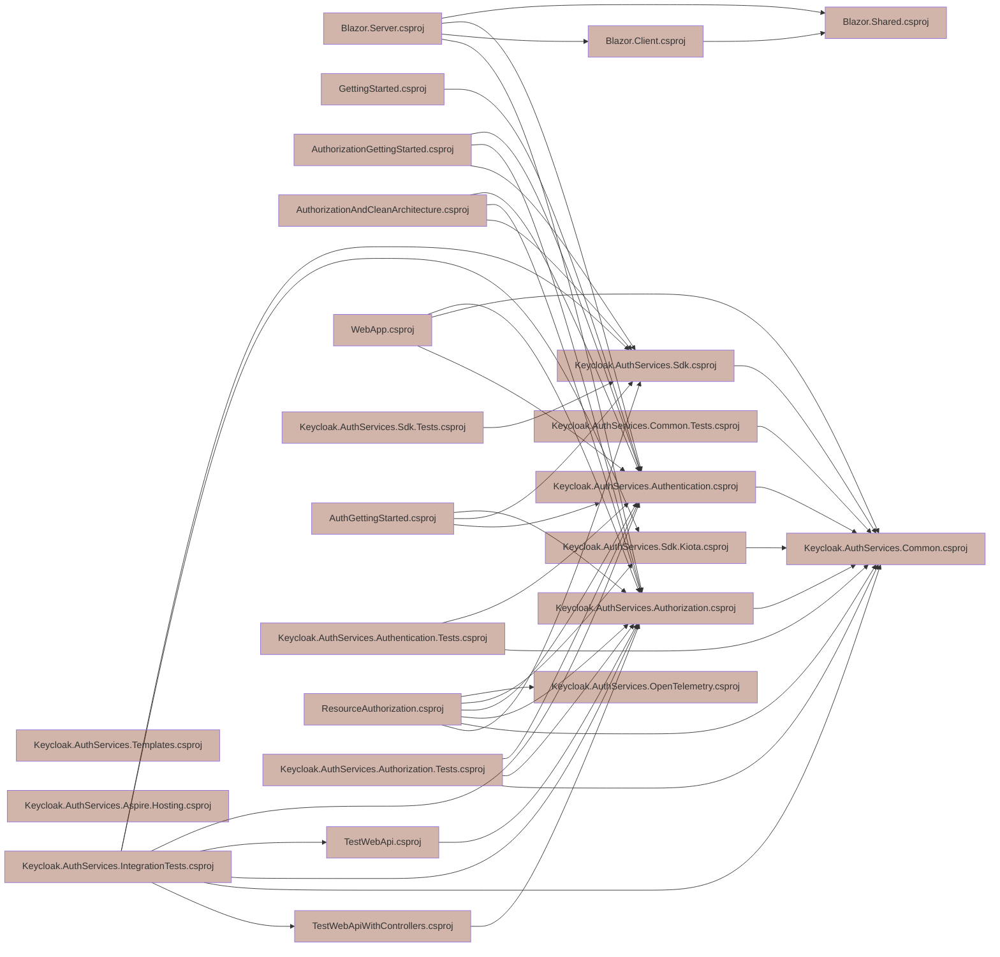

# Dependify

[](https://github.com/NikiforovAll/dependify/actions/workflows/build.yml)
[](https://nuget.org/packages/Dependify.Cli)
[](https://github.com/nikiforovall/dependify)
[](https://conventionalcommits.org)
[](https://github.com/nikiforovall/dependify/blob/main/LICENSE.md)

Dependify is a tool to visualize dependencies in your .NET application. You can start dependify in `serve` mode to visualize dependencies in a browser or use the `CLI` if you prefer the terminal.

| Package          | Version                                                                                                  | Description                          |
| ---------------- | -------------------------------------------------------------------------------------------------------- | ------------------------------------ |
| `Dependify.Cli`  | [](https://nuget.org/packages/Dependify.Cli)   | CLI                    |
| `Dependify.Core` | [](https://nuget.org/packages/Dependify.Core) | Core library       |
| ` Dependify.Aspire.Hosting` | [](https://nuget.org/packages/Dependify.Aspire.Hosting) | Aspire support |

## Install

```bash
dotnet tool install -g Dependify.Cli
```

```bash
❯ dependify -h
USAGE:
    Dependify.Cli.dll [OPTIONS] <COMMAND>

EXAMPLES:
    Dependify.Cli.dll graph scan ./path/to/folder --framework net8
    Dependify.Cli.dll graph show ./path/to/project --framework net8

OPTIONS:
    -h, --help    Prints help information

COMMANDS:
    graph
    serve <path>
```

## Usage

```bash
dependify serve $dev/path-to-folder/
```

You will see something like the following output in the terminal.


### Features

-   Workbench ⚙️
-   Dependency Explorer 🔎
-   Chat (AI) 🤖

Workbench gives you high level overview of the dependencies in the solution.

<video src="https://github.com/user-attachments/assets/e3eecf59-864d-4a7b-9411-60ee7a364c57" controls="controls">
</video>

You can open the mermaid diagram right in the browser.


Dependency Explorer allows you to select the dependencies you want to see.

<video src="https://github.com/user-attachments/assets/555df3ef-b0c3-4354-911f-81d4dfd07607" controls="controls">
</video>

Chat (AI) allows you to ask questions about the dependencies.

```bash
dependify serve $dev/cap-aspire/ \
    --endpoint https://api.openai.azure.com/ \
    --deployment-name gpt-4o-mini \
    --api-key <api-key>
```

<video src="https://github.com/user-attachments/assets/b07a8b53-d3d2-4ef8-9a8c-8c3dbd865350" controls="controls">
</video>

### Aspire support

You can add `Dependify.Web` as resource to your Aspire project.

Add the package to AppHost:

```bash
dotnet add package Dependify.Aspire.Hosting
```

Register via `IDistributedApplicationBuilder`. Add the following code to your `Program.cs`:

```csharp
var builder = DistributedApplication.CreateBuilder(args);

var apiService = builder.AddProject<Projects.aspire_project_ApiService>("apiservice");

builder.AddProject<Projects.aspire_project_Web>("webfrontend")
    .WithExternalHttpEndpoints()
    .WithReference(apiService);

builder.AddDependify().ServeFrom("../../aspire-project/"); // <-- location of .sln file

builder.Build().Run();
```

See the [samples/aspire-project](./samples/aspire-project) for more details.

### CLI

You can use the CLI for the automation or if you prefer the terminal.

```bash
dependify graph --help
```

```text
USAGE:
    dependify graph [OPTIONS] <COMMAND>

EXAMPLES:
    dependify graph scan ./path/to/folder --framework net8
    dependify graph show ./path/to/project --framework net8

OPTIONS:
    -h, --help    Prints help information

COMMANDS:
    scan <path>    Scans for projects and solutions and retrives their dependencies
    show <path>    Shows the dependencies of a project or solution located in the specified path
```

The command `scan` will scan the folder for projects and solutions and retrieve their dependencies. The ouput can be in `tui` or `mermaid` format. The `tui` or terminal user interface is the default output format.

```bash
dependify graph scan $dev/keycloak-authorization-services-dotnet/
```


Here is how to change the output format to `mermaid`.

```bash
dependify graph scan \
    $dev/keycloak-authorization-services-dotnet/ \
    --exclude-sln \
    --format mermaid \
    --output ./graph.md
```



### API

You can use the API to build your own tools.

```bash
dotnet add package Dependify.Core
```

```csharp
var services = new ServiceCollection()
    .AddLogging()
    .AddSingleton<ProjectLocator>()
    .AddSingleton<MsBuildService>();

var provider = services.BuildServiceProvider();

var locator = provider.GetRequiredService<ProjectLocator>();
var msBuildService = provider.GetRequiredService<MsBuildService>();

var nodes = locator.FullScan("C:\\Users\\joel\\source\\repos\\Dependify");

var solution = nodes.OfType<SolutionReferenceNode>().FirstOrDefault();

var graph = msBuildService.AnalyzeReferences(solution, MsBuildConfig.Default);

var subgraph = graph.SubGraph(n => n.Id.Contains("AwesomeProjectName"));
```

## Build and Development

`dotnet cake --target build`

`dotnet cake --target test`

`dotnet cake --target pack`

`dotnet tool install --global --add-source ./Artefacts Dependify.Cli --prerelease`

`dotnet tool uninstall Dependify.Cli -g`

```bash
dotnet watch run --project ./src/Dependify.Cli/ -- \
    serve $dev/cap-aspire/ \
    --endpoint "http://localhost:1234/v1/chat/completions" \
    --model-id "LM Studio Community/Meta-Llama-3-8B-Instruct-GGUF" \
    --api-key "lm-studio" \
    --log-level "Information"
```

```bash
dotnet watch run --project ./src/Dependify.Cli/ -- \
    serve $dev/cap-aspire/ \
    --endpoint "" \
    --deployment-name "gpt-35-turbo" \
    --api-key "" \
    --log-level "Information"
```
Set the API key for the AppHost with the following command:

```bash
dotnet user-secrets set "Parameters:api-key" "<api-key>"
dotnet user-secrets set "Parameters:endpoint" "<endpoint>"
```
